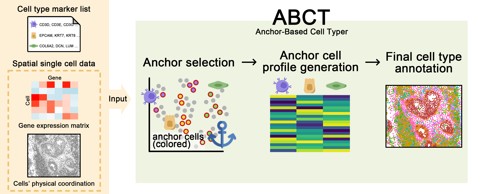

# ABCT
ABCT(Anchor-based Cell Typer)




## Overview

ABCT is a hybrid cell type annotation method designed for spatial omics data, combining the simplicity of marker-based annotation with the reliability of profile-based methods. It calculates cell type scores using a list of marker genes for each cell type and incorporates spatial information by considering the expression of neighboring cells. This enables the identification of anchor cells that represent each cell type, creating a profile that is then used to annotate the entire dataset.

The key advantages of ABCT include:

- No complex integration with scRNA-seq datasets required
- Support for novel cell types defined by the user
- Effective utilization of spatial information for accurate cell type classification
- Clear differentiation between malignant and normal epithelial cells in tumor samples

ABCT is compatible with a wide range of spatial technologies (e.g., 10x Xenium, MERFISH, CosMX, CODEX) and scales efficiently for large datasets. For more information, check out:

- the [paper](https://www.nature.com/articles/s41588-024-01664-3), (논문 링크)
- a tutorial on ABCT, a set of [vignettes](https://prabhakarlab.github.io/Banksy) showing basic usage, usage compatibility with Seurat ([here](https://github.com/satijalab/seurat-wrappers/blob/master/docs/banksy.md) and [here](https://satijalab.org/seurat/articles/visiumhd_analysis_vignette#identifying-spatially-defined-tissue-domains)),  (tutorial)
- a [Zenodo archive](https://zenodo.org/records/10258795) containing scripts to reproduce the analyses in the paper (데이터 다운로드 페이지?)


## Quick start
### Loading Required Libraries
Ensure that all necessary libraries are installed and loaded.

```{r libraries}
library(Seurat)
library(SeuratWrappers)
library(Banksy)
library(harmony)
library(dplyr)
library(scales)
library(EnvStats)
library(stringr)
library(matrixStats)
library(InSituType)
library(UCell)
library(ggplot2)
library(MASS)
library(pracma)
source("./ABCT.r")
```

### Loading and Preparing Data
Load the data for analysis. Here, we demonstrate using a Seurat object. The processed data can be downloaded from https://kbds.re.kr/hissta/datasetinfo?sampleIdx=19.
```{r load-data}
obj <- readRDS(paste0("/path/to/your/data/", "obj_final.rds"))
```

### Define Cell Type List and Marker Genes
We define a list of cell types and specify marker genes for the analysis.
```{r cell-types}
celltype_list <- c("Malignant", "Epithelial", "CD4T", "CD8T", "NK", "B", "Plasma",
                   "Macrophage", "Monocyte", "DC", "Mast", "Neutrophil", 
                   "Endothelial", "Fibroblast", "Unknown")
names(celltype_list) <- c(
  "#bf4040", "#FB8072", "#8DD3C7", "#FFFFB3", "#BEBADA", "#3288bd", 
  "#FDB462", "#B3DE69", "#FCCDE5", "#84cdee", "#BC80BD", "#CCEBC5", 
  "#FFED6F", "#1b9e77", "gray"
)
malignant_marker_list <- data.frame(
  cluster = "Malignant",
  gene = c("SOX9", "FGFR1", "KRAS", "MYC", "EGFR")
)
ABCT_marker_list <- read.csv("/path/to/marker_list.csv")
ABCT_marker_list$cluster <- factor(ABCT_marker_list$cluster, levels = celltype_list)
ABCT_marker_list <- ABCT_marker_list %>% arrange(cluster)
```

### Identifying Malignant Cells
Use the `FindMalignantCells` function to identify malignant cells in the data.
```{r find-malignant}
malignant_path <- "/path/to/output/malignant/"
obj <- FindMalignantCells(
  obj,
  assay = "SCT",
  ctrl_assay = "negprobes",
  marker_list = malignant_marker_list,
  use_spatial = TRUE,
  M = 1,
  lambda = 0.2,
  area = NULL,
  w_neg = 0,
  dimx = "x_global_px",
  dimy = "y_global_px",
  smooth_reduction = "spatial_pca",
  path = malignant_path
)
```

### Performing ABCT Classification
Subsequently, classify the non-malignant cells using the RunABCT function. By default, if a BANKSY object already exists in the Seurat object, RunABCT will use the existing BANKSY object rather than running it again. If you wish to rerun BANKSY on a subsetted object, you should remove the existing BANKSY assay before executing the function.
```{r run-abct}
subobj <- subset(obj, subset = malignant_result != "Malignant")
abct_path <- "/path/to/output/abct/"
subobj <- RunABCT(
  subobj,
  assay = "SCT",
  ctrl_assay = "negprobes",
  marker_list = ABCT_marker_list,
  color_list = names(celltype_list[celltype_list %in% ABCT_marker_list$cluster]),
  method = "quantile",
  use_spatial = TRUE,
  M = 1,
  lambda = 0.2,
  dimx = "x_global_px",
  dimy = "y_global_px",
  smooth_reduction = "spatial_pca",
  path = abct_path
)
```

### Updating Metadata
Finally, update the metadata in the original object with the ABCT classification results.
```{r update-metadata}
obj <- update_metadata(obj, subobj, celltype_list)
```

<br>
<br>
<details>
<summary><strong>Session Info</strong></summary>
```{r sessioninfo}
sessionInfo()
```
</details>
<br>
<br>


